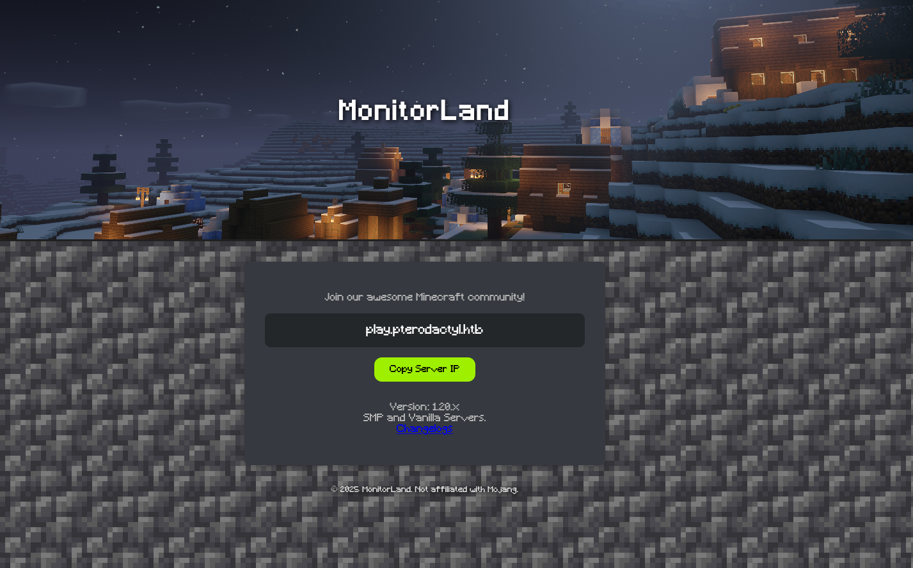
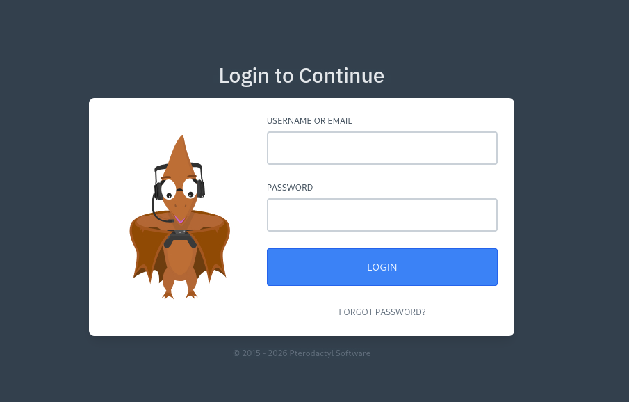
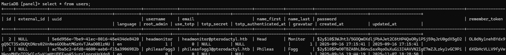
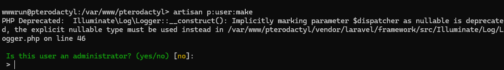
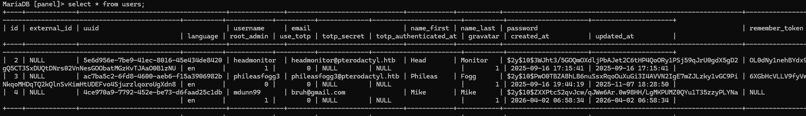
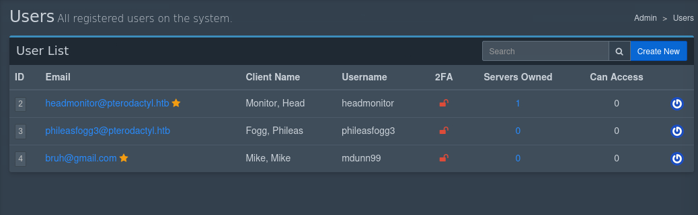
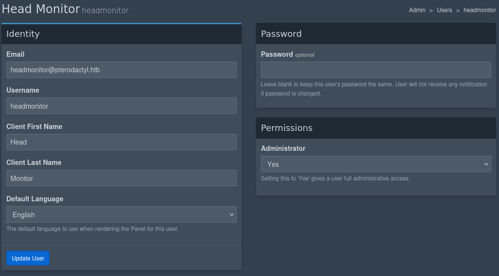
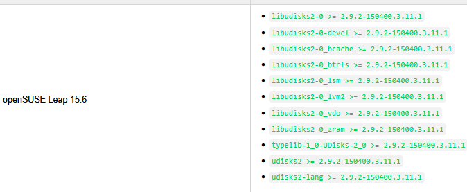

Pterodactyl is a medium difficulty Linux HackTheBox machine: https://app.hackthebox.com/machines/Pterodactyl?sort_by=created_at&sort_type=desc

I ran a standard nmap service scan:
```bash
Not shown: 986 filtered tcp ports (no-response), 10 filtered tcp ports (admin-prohibited)
PORT     STATE  SERVICE    VERSION                                                                     
22/tcp   open   ssh        OpenSSH 9.6 (protocol 2.0)                                                   
80/tcp   open   http       nginx 1.21.5                                                                 
443/tcp  closed https                                                                                   
8080/tcp closed http-proxy   
```

I navigated to the web server, which had an unresolvable domain name: pterodactyl.htb. I added the IP to my hosts to resolve it in my browser:


# Reconnaissance
I did a fuzz using SecList's raft-medium-files on the root directory, adding php and txt extensions just as a standard practice:
`ffuf -u http://pterodactyl.htb/FUZZ -w raft-medium-files.txt -e .php,.txt -c`

The fuzz returned files such as `index.php`, `phpinfo.php`, `global.css`, and `changelog.txt`. Some things in changelog included useful version information about the server like: "[Installed] Pterodactyl Panel **v1.11.10**", "MariaDB **11.8.3** backend." We'll also collect information in phpinfo.php [which is a valuable trove of config information](https://www.php.net/manual/en/function.phpinfo.php) related to the PHP server.

I also make it a habit to enumerate through subdomains, which returned a panel.pterodactyl.htb:


---
After iterating for a while through various version numbers found in phpinfo.php for vulnerabilities, I found a critical severity exploit titled [CVE-2025-49132](https://app.opencve.io/cve/CVE-2025-49132) with arbitrary write privileges consistent with changelog.txt's claim of the server's Minecraft Pterodactyl Panel <v1.11.9. A [PoC published by YoyoChaud](https://github.com/YoyoChaud/CVE-2025-49132))allowed for easy testing.



**Upgrading TTY without Python**

I'm used to getting a clearer shell by using Python, but that's not installed n this box. We can also use the `script` command to effectively do the same thing:
```bash
script /dev/null -c bash
```
And then proceed with the standard backgrounding: `Ctrl+Z`, echoing the terminal and bringing the background process to the foreground: `stty raw -echo; fg`, using `reset` and `export TERM=xterm`.


# User Privilege Escalation
Earlier, in php.info, we discovered that a mysqli server also runs on the server on it's default port, 3306. This is confirmed when we run `env` to output environment variables to our terminal (truncated):
```
DB_PORT=3306
DB_HOST=127.0.0.1
HASHIDS_SALT=pKkOnx0IzJvaUXKWt2PK
PWD=/var/www/pterodactyl/public
APP_KEY=base64:UaThTPQnUjrrK61o+Luk7P9o4hM+gl4UiMJqcbTSThY=
DB_PASSWORD=PteraPanel
APP_URL=http://panel.pterodactyl.htb
DB_USERNAME=pterodactyl
APP_SERVICE_AUTHOR=pterodactyl@pterodactyl.htb
SESSION_DRIVER=redis
DB_CONNECTION=mysql
DB_DATABASE=panel
_=/usr/bin/env
```

We can connect by using mysql on the box: `mysql -u pterodactyl -pPteraPanel`, but:
`ERROR 1045 (28000): Access denied for user 'pterodactyl'@'localhost' (using password: YES)`

I figure I'll manually specify 127.0.0.1 rather than allowing mysql to resolve to localhost using `-h 127.0.0.1`, and I can successfully see our databases, notably the locked `panel`:
```
MariaDB [(none)]> show databases;
+--------------------+
| Database           |
+--------------------+
| information_schema |
| panel              |
| test               |
+--------------------+
3 rows in set (0.001 sec)
```

`panel`'s `users` table contains some hashes (of which I couldn't crack):


I poked around in the root `/var/www/pterodactyl` directory and found the `artisan` binary, of which I could potentially just create my own user using `artisan p:user:make`:


Which is then appended to the mysql users db:


So, I'll try logging into the pterodactyl panel with my new credentials (mdunn99:password). We have direct access to the other users we saw earlier in the database and can change their passwords:



Upon numerous SSH attempts, I was still prompted with a password requirement, and *overwriting those users' passwords was preventing me from using it as a potential duplicate password for the SSH password.*

I revisited the cracking attempt and successfully cracked user `phileasfogg3`'s bcrypt hash which matched their SSH password, and retrieved the user.txt flag.
# Root Privilege Escalation
As I'm checking out files with capabilities and anything that looks interesting on the file system (including the previously mentioned artisan binary), I'm running a [linpeas.sh instance](https://github.com/peass-ng/PEASS-ng/tree/master/linPEAS), which notifies me that there are some mail messages on the phileasfogg3 user. Let's read:

```bash
From headmonitor@pterodactyl Fri Nov 07 09:15:00 2025
Delivered-To: phileasfogg3@pterodactyl
Received: by pterodactyl (Postfix, from userid 0)
id 1234567890; Fri, 7 Nov 2025 09:15:00 +0100 (CET)
From: headmonitor headmonitor@pterodactyl
To: All Users all@pterodactyl
Subject: SECURITY NOTICE — Unusual udisksd activity (stay alert)
Message-ID: 202511070915.headmonitor@pterodactyl
Date: Fri, 07 Nov 2025 09:15:00 +0100
MIME-Version: 1.0
Content-Type: text/plain; charset="utf-8"
Content-Transfer-Encoding: 7bit

Attention all users,

Unusual activity has been observed from the udisks daemon (udisksd). No confirmed compromise at this time, but increased vigilance is required.

Do not connect untrusted external media. Review your sessions for suspicious activity. Administrators should review udisks and system logs and apply pending updates.

Report any signs of compromise immediately to headmonitor@pterodactyl.htb

— HeadMonitor
System Administrator
```

grepping systemctl for udisks confirms this service is running:
```bash
phileasfogg3@pterodactyl:~> systemctl | grep udisks
udisks2.service ... loaded active running | Disk Manager
```

Per the [Arch Linux wiki:](https://wiki.archlinux.org/title/Udisks):
> [udisksd(8)](https://man.archlinux.org/man/udisksd.8) is started on-demand by [D-Bus](https://wiki.archlinux.org/title/D-Bus "D-Bus") and should not be enabled explicitly. It can be controlled through the command-line with [udisksctl(1)](https://man.archlinux.org/man/udisksctl.1).

Running `udisksctl dump` will include the version number for udisks2: **2.9.2**, which reveals a vulnerability that affects a few operating systems. To confirm if the operating system of the box is vulnerable, I read /etc/os-release: **openSUSE Leap 15.6**, which is a listed vulnerable target for udisks2 versions >= 2.9.2:

*Source: https://www.suse.com/security/cve/CVE-2025-8067.html*

A PoC is published by [born0monday](https://github.com/born0monday/CVE-2025-8067). After running it, I'm unfortunately met with this error:
```bash
gi.repository.GLib.Error: g-io-error-quark: GDBus.Error:org.freedesktop.UDisks2.Error.NotAuthorizedCanObtain: Not authorized to perform operation (36)
```

A [published seclists.org mail/blog](https://seclists.org/oss-sec/2025/q3/143) provides us with a helpful hint for getting around this issue:
> 
>     So really depends how is your session classified and yes, the attack
>     surface is slightly lower for non-local seats. However, combine it with
>     other CVEs, notably CVE-2025-6018, and you have a bigger problem.
> 
> CVE-2025-6018: LPE from unprivileged to allow_active in *SUSE 15's PAM
> https://www.openwall.com/lists/oss-security/2025/06/17/4

which leads me to:
> CVE-2025-6018: LPE from unprivileged to allow_active in SUSE 15's PAM
> CVE-2025-6019: LPE from allow_active to root in libblockdev via udisks

and [a website](https://www.openwall.com/lists/oss-security/2025/06/17/4) that walks me through the whole process of exploiting openSUSE Leap 15 "via the udisks daemon." I successfully create a malicious payload (on the attack machine) and mount it using a loop block (with udisks) on the victim machine, giving me a root shell.